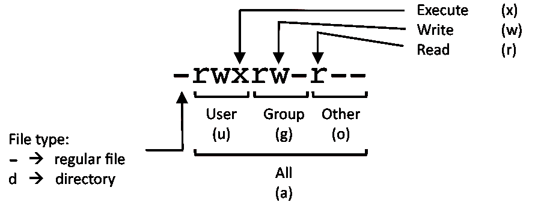

# FILE PERMISSIONS

U | G | W | EXAMPLE
--- | --- | --- | ---
rwx | rwx | rwx | chmod 777 filename
rwx | rwx | r-x | chmod 775 filename
rwx | r-x | r-x | chmod 755 filename
rw- | rw- | r-- | chmod 664 filename
rw- | r-- | r-- | chmod 644 filename

**LEGEND**
- `U = User`
- `G = Group`
- `W = World`
- `r = Read`
- `w = write`
- `x = execute`
- `- = no access`

---

[Back](../basic-command.md)